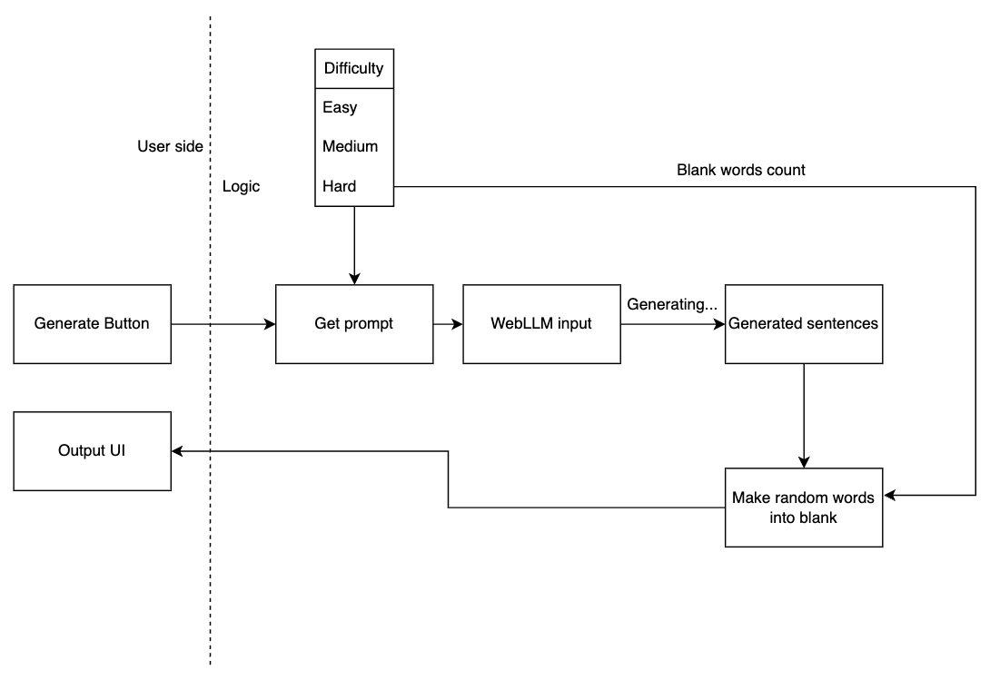

# fill-in-the-blank-generator

## project overview

## goals
- [x] Basic website design
- [x] Link webllm to user input
- [x] Make proper prompt for fill in the blank game
- [x] Update logic for the game
- [ ] Update model choosing logic
- [ ] Design and update more content (like N combo)
- [ ] Add donate button?

## dependency
[web-llm](https://github.com/mlc-ai/web-llm)
